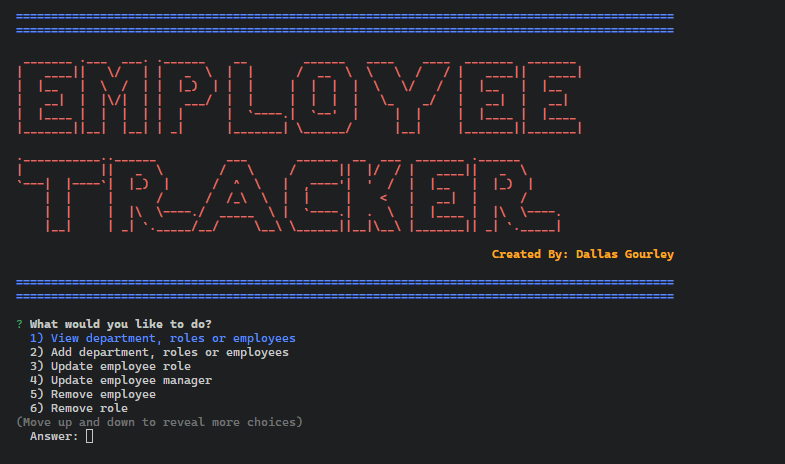
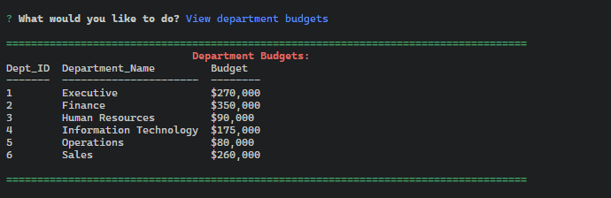

  
# Employee Tracker

  This project is an business management application that allows a user to interact with a mysql database that includes departments, roles and employees that exist in the company. The application is built using Nodejs, Inquirer, console.table and mysql.

  [](https://opensource.org/licenses/MIT)

  Employee-Tracker

  [The repository can be viewed here.](https://github.com/dgourley84/Employee-Tracker)

  ---
## Contents
1. [About](#about)
    1. [Usage](#usage)
    2. [User Story](#user-story)
    3. [Acceptance criteria](#acceptance-criteria)
    4. [Visuals](#visuals)
2. [Installation](#installation)
3. [License](#license)
4. [Contributing](#contributing)
5. [Tests](#tests)
6. [Authors and acknowledgment](#authors-and-acknowledgments)
7. [Questions](#questions)
---
## About

  This project is an business management application that allows a user to interact with a mysql database that includes departments, roles and employees that exist in the company. The application is built using ```Nodejs```, ```Inquirer```, ```console.table``` and ```mysql```.

  
---
## Usage
  
  Install the applicaiton dependancies using the above command, initialize the database in mysql by running mysql -u ```<user>``` -p ```<password>```. Then, source db/schema.sql followed by source db/seeds.sql. 
  
  Now that the database is initialized, run npm start to run the CLI application and interacti with it as you wish.

  When a user starts the application, they are presented with a series of prompts, randing from view database information to changing or deleting information.

  

  After selecting a prompt, the application will handle the user request by querying the database and returning the data in a ```console.table``` command for easy reading. An example output is below:

  

  After the output is returned, the application will provide the user with another opportunity to select a new way to interact with the database - the same way that the user is prompted when the application is first started.

When the user is done with the applications, they can exit using the command control + c.

All of the base acceptance criteia has been met, along with 5 bonus criteria: Budget per department, delete department, delete role, delete employee, view employees by department.

---
## User Story
  
  ```bash
  AS A business owner
  I WANT to be able to view and manage the departments, roles, and employees in my company
  SO THAT I can organize and plan my business
  ```

---
## Acceptance Criteria
  ```bash
GIVEN a command-line application that accepts user input
WHEN I start the application
THEN I am presented with the following options: view all departments, view all roles, view all employees, add a department, add a role, add an employee, and update an employee role
WHEN I choose to view all departments
THEN I am presented with a formatted table showing department names and department ids
WHEN I choose to view all roles
THEN I am presented with the job title, role id, the department that role belongs to, and the salary for that role
WHEN I choose to view all employees
THEN I am presented with a formatted table showing employee data, including employee ids, first names, last names, job titles, departments, salaries, and managers that the employees report to
WHEN I choose to add a department
THEN I am prompted to enter the name of the department and that department is added to the database
WHEN I choose to add a role
THEN I am prompted to enter the name, salary, and department for the role and that role is added to the database
WHEN I choose to add an employee
THEN I am prompted to enter the employee’s first name, last name, role, and manager, and that employee is added to the database
WHEN I choose to update an employee role
THEN I am prompted to select an employee to update and their new role and this information is updated in the database
  ```
  
---
## Visuals:
  
  

### Video demo
  A video demonstraction of the app can be viewed here:

  https://drive.google.com/file/d/1FAX-BmZxQlNztFyY5cs33SfzIOhvadh-/view

---
## Installation:

  To Install and run this application yourself, follow the below step(s).

  ```bash
  npm i
  ```

---
## License
  License used for this project - MIT
  * For more information on license types, please reference this website
  for additional licensing information - [https: //choosealicense.com/](https://choosealicense.com/).
---

## Contributing:

  To contribute to this application, create a pull request.
  Here are the steps needed for doing that:
  - Fork the repo
  - Create a feature branch (git checkout -b NAME-HERE)
  - Commit your new feature (git commit -m 'Add some feature')
  - Push your branch (git push)
  - Create a new Pull Request
  Following a code review, your feature will be merged.

---

## Tests:

  This app does not have any tests. However in ```media``` folder of repository are a number of screenshots showing the functionality of the app which were used to test the working of the app.

---
## Authors & Acknowledgments

  Dallas Gourley

---

## Questions:
* GitHub Username: [dgourley84](https://github.com/dgourley84)
* GitHub Email: (dallas.gourley@yahoo.com)


